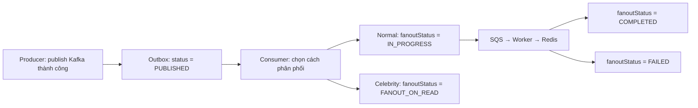
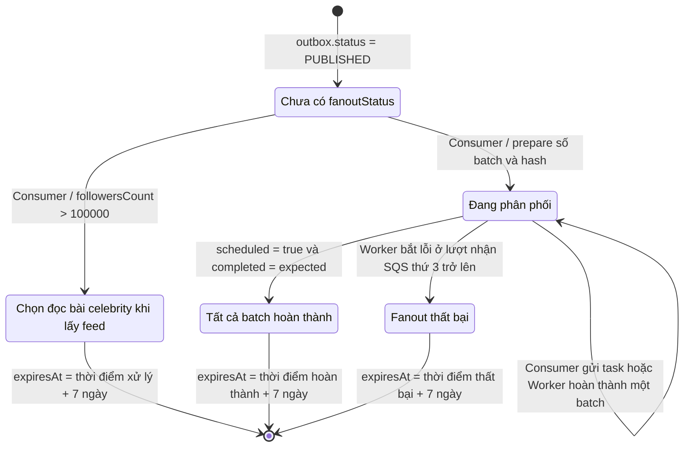
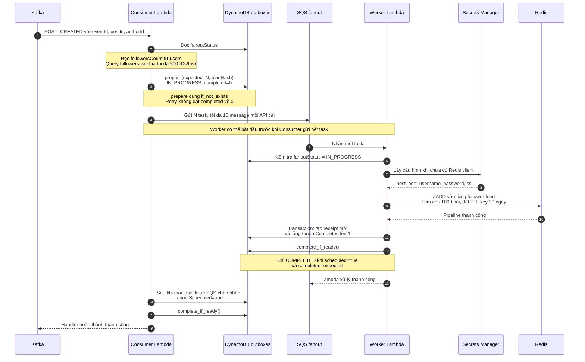
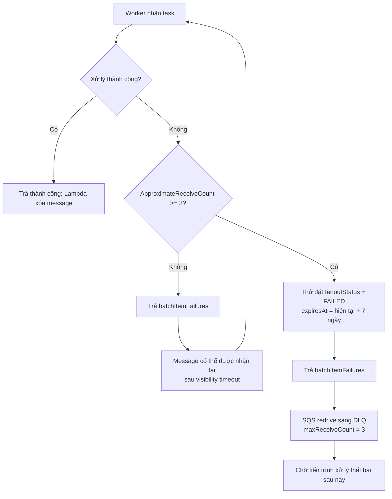

# Fanout state giữa Consumer và Worker

Tài liệu mô tả code tại commit `3c6330c` của repository `kafka-python-handler`.
Các khối Mermaid có thể hiển thị thành sơ đồ trong GitHub hoặc trình đọc Markdown hỗ trợ Mermaid.

## 1. Hai trạng thái trên cùng một outbox

`status` theo dõi việc publish Kafka. `fanoutStatus` theo dõi việc phân phối Post đến feed của follower. Sau khi publish thành công, `status` giữ giá trị `PUBLISHED` trong suốt quá trình fanout.



`FANOUT_ON_READ` chỉ xác nhận đã chọn nhánh celebrity. API đọc feed vẫn cần lấy bài celebrity và trộn vào kết quả; consumer không thực hiện bước đọc feed đó.

## 2. Sơ đồ chuyển trạng thái



Consumer bỏ qua event gửi lại nếu `fanoutStatus` đã là `COMPLETED`, `FAILED` hoặc `FANOUT_ON_READ`. Nếu đang `IN_PROGRESS`, consumer tiếp tục nhánh ghi feed, kể cả khi `followersCount` đã vượt ngưỡng celebrity.

## 3. Luồng thành công giữa Consumer và Worker



Consumer và worker đều gọi `complete_if_ready()`. Vì vậy, dù worker hoàn thành trước hay sau khi consumer đặt `fanoutScheduled=true`, bên chạy sau vẫn có thể kết thúc event. Nếu không có follower, `expected=completed=0`; consumer tự hoàn thành sau bước `scheduled()`.

## 4. Retry và DLQ



Cấu hình hiện tại là **3 lượt nhận tổng cộng**, gồm lượt đầu tiên. Worker không chạy vòng lặp gọi Redis ba lần trong một invocation. `VisibilityTimeout` là 360 giây, timeout worker là 60 giây.

Việc cập nhật `FAILED` diễn ra trong worker trước khi SQS chuyển message sang DLQ. Nếu Lambda bị timeout, không chạy được, hoặc ghi DynamoDB thất bại, message có thể vào DLQ trong khi outbox vẫn `IN_PROGRESS`. Code hiện chưa có tiến trình đối soát DLQ để sửa trường hợp này.

`FAILED` áp dụng cho toàn bộ event. Các task còn lại nhìn thấy trạng thái này sẽ bị worker từ chối và tiếp tục cơ chế retry/DLQ; các lần ghi Redis đã thành công trước đó không bị rollback.

## 5. Các trường dữ liệu

| Trường trên outbox | Ai ghi | Ý nghĩa |
|---|---|---|
| `status` | Producer | Trạng thái publish Kafka; giữ `PUBLISHED` khi fanout chạy |
| `fanoutStatus` | Consumer và Worker | `IN_PROGRESS`, `COMPLETED`, `FAILED`, `FANOUT_ON_READ` |
| `fanoutExpected` | Consumer | Tổng số SQS task, không phải tổng follower |
| `fanoutCompleted` | Worker | Số task đã ghi Redis thành công và được ghi nhận bằng transaction |
| `fanoutScheduled` | Consumer | `true` sau khi tất cả task được SQS chấp nhận |
| `fanoutPlanHash` | Consumer | Hash danh sách task để phát hiện kế hoạch thay đổi khi Kafka gửi lại |
| `fanoutFailedAt` | Worker | Thời điểm ghi nhận thất bại |
| `expiresAt` | Consumer hoặc Worker | Unix timestamp theo giây để DynamoDB TTL dọn outbox |

Mỗi task thành công tạo thêm một item receipt trong cùng bảng `outboxes`:

```text
PK        = FANOUT_TASK#{eventId}#{taskId}
expiresAt = thời điểm ghi receipt + 30 ngày
```

Transaction tạo receipt với điều kiện chưa tồn tại và tăng `fanoutCompleted` cùng lúc. Khi task gửi lại, receipt đã tồn tại sẽ ngăn bộ đếm tăng thêm. Worker vẫn có thể ghi Redis lại trước khi kiểm tra receipt: `ZADD` dùng cùng `postId` và điểm thời gian nên không tạo hai member cho cùng Post.

Redis và DynamoDB không nằm trong một transaction chung. Nếu Redis ghi xong nhưng DynamoDB lỗi, task sẽ retry; lần ghi Redis lặp lại là một phần của thiết kế này.

## 6. Ví dụ 1.001 follower

Consumer tạo ba task: `taskId=0` chứa 500 follower, `taskId=1` chứa 500 follower và `taskId=2` chứa 1 follower.

| Thời điểm | Expected | Completed | Scheduled | Fanout status |
|---|---:|---:|---|---|
| Consumer prepare | 3 | 0 | Chưa có | `IN_PROGRESS` |
| Worker hoàn thành task 0 sớm | 3 | 1 | Chưa có | `IN_PROGRESS` |
| Consumer gửi hết task | 3 | 1 | `true` | `IN_PROGRESS` |
| Worker hoàn thành task 2 | 3 | 2 | `true` | `IN_PROGRESS` |
| Task 0 được gửi lại | 3 | 2 | `true` | `IN_PROGRESS` |
| Worker hoàn thành task 1 | 3 | 3 | `true` | `COMPLETED` |

## 7. Giới hạn cần biết khi đọc sơ đồ

- Consumer dựng lại danh sách follower khi Kafka gửi lại event. Nếu danh sách thay đổi làm `fanoutPlanHash` khác, `prepare()` báo lỗi; code chưa lưu một snapshot task cố định để tự phục hồi trường hợp này.
- Task từ phiên bản consumer cũ chưa có `taskId` sẽ bị worker mới từ chối. Cần xử lý backlog cũ khi nâng cấp.
- Queue và DLQ hiện có retention một ngày; outbox thành công hoặc thất bại có TTL bảy ngày. `expiresAt` là mốc đủ điều kiện xóa, không bảo đảm item bị xóa ngay tại mốc đó.
- `COMPLETED` xác nhận các pipeline Redis và ghi nhận DynamoDB đã thành công tại thời điểm xử lý. Redis feed có thể bị trim, hết TTL hoặc mất do sự cố cache sau đó; Post gốc vẫn được lưu riêng trong DynamoDB.

Code tham chiếu: `lambdas/lambda_function_consumer.py`, `lambdas/lambda_function_worker.py`, `lambdas/fanout_state.py` và `infra/template.yml` tại [commit 3c6330c](https://github.com/haruyuki7121994/kafka-python-handler/commit/3c6330c).
